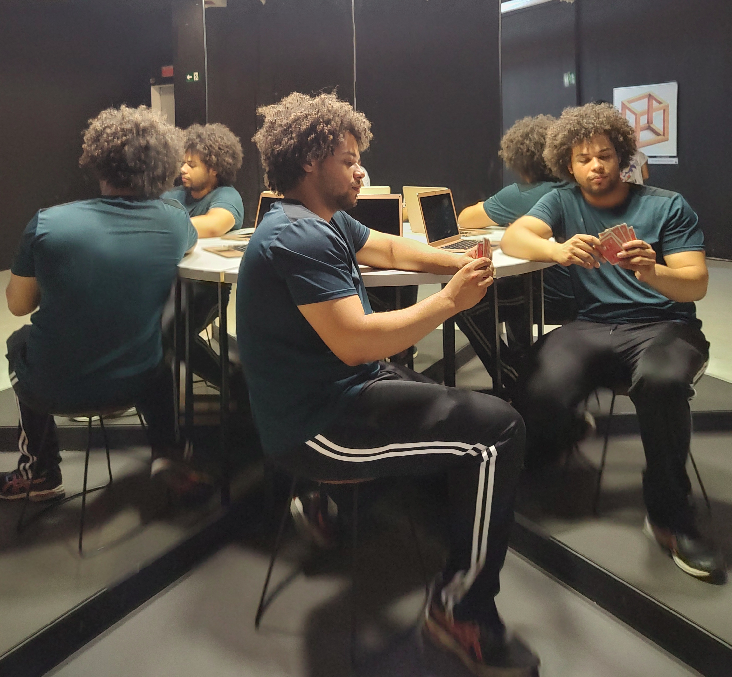

---
# the default layout is 'page'
icon: fas fa-info-circle
order: 4
---

# Hi, I'm Hitalo Cesar and I am glad you're here :)

I was born in 2000 and am from Araxa, a small town in the state of Minas Gerais in Brazil but currently I live in Campinas-SP. I have bachelor's degree in Computer Engineering by UNICAMP and am currently an Android framework software engineer at Motorola. In the professional/educational side, I am interested in many different topics such as algorithms, nature-inspired algorithms, computer theory, mathematics, Android operating system, application development, software engineering and others. I am always willing to learn new things and face new challenges.

Out of the professional/eduational side, I also love sports(specially martial arts and chess), music and musical instruments(specially the string ones); detail: for both things(sports and music) I'm merely an admirer with very limited skills hehehe. I also appreciate to have conversations about random subjects like philosophy, astronomy, physics and things like that.

## Professional Experiences

- **Software engineer at Motorola - intern and contract**
  - *2021 - Now*
  - Designed and implemented customizations in the Android operating system, with a specific focus on the framework, SystemUI, internal privileged/system and security applications to align with Motorola's strategic objectives, serving a global user base of millions.
  -  Resolved various bugs, including UX and performance issues, leading to an enhanced user experience for a global audience.
  -  Played a key role in the conception, prototyping, and implementation of exclusive features for premium segment devices, particularly foldable ones.
  -  Explored Android Open Source Project (AOSP) architecture and its operational aspects, including building, code search, and related procedures
  -  Developed software solutions with a critical eye for quality while maintaining open lines of communication with customer experience and testing teams, consistently advocating for the best possible user experience within the technical constraints.

- **Academic cooperation in nature-inspired algorithms at UNIGOU/Brno University in Czech Republic(remote) - academic**
  - *2023*
  - Employed Python to develop an educational interface aimed at aiding undergraduate and graduate students at Brno University in comprehending Particle Swarm Optimization (PSO) and its application in solving the Traveling Salesperson Problem (TSP).
  - Perform in-depth analysis on PSO, exploring the impact of parameter variations and creating customized versions of it.
  - Perform literature review to gain a comprehensive understanding of key nature-inspired optimization algorithms, such as PSO, Genetic Algorithm(GA), Ant Colony Optimization(ACO), among others.

- **Scientific initiation in mathematics at UNICAMP - academic**
  - *2019 - 2021*
  -  I was one of the authors of a research paper titled:  "Estudo analítico e computacional de uma equação diferencial estocástica associada a um modelo de crescimento populacional" published in a national magazine. In the paper stochastic calculus is applied to model and simulate population growth. [Download the article here](../assets/pdfs/crescimento_populacional_estocastico.pdf).
  - Applied Python and computer skills to simulate and validate theoretical stochastic calculus concepts.
  - Engaged in theoretical studies related to stochastic calculus topics and mathematical concepts related to this field.

- **Biomedical Engineering Technician internship at CEB - intern**
  - *2019 - 2020*
  - Developed a low cost cardiac monitor using ESP32 and a touch screen display.
  - Understand the principles of biomedical engineering
  - Observed interdisciplinary engineering professionals performing maintenance on biomedical devices.

- **Internships at UNICAMP - intern**
  - *2018 - 2021*
  - Dveloped activities in different fields, those activities are related to jobs created by UNICAMP to help students in vulnerable financial situation to keep the college.
  - Tested and contributed to the enhancement of tractography methodologies using software developed by an UNICAMP research group.
  - Collaborated with a mathematics professor in the development of class notes for a Calculus 1 course.

## Education

- **Bachelor's Degree in Computer Engineering, Graduated with Distinction**
  - *State University of Campinas - UNICAMP, Campinas-SP*
  - *Conclusion: 2023*

- **Technical Course in Electronics**
  - *CEFET, Araxá-MG*
  - *Conclusion: 2017*

[Download Resume pdf](../assets/pdfs/Resume.pdf)

## Let's Connect!

If you read until here, thanks so much for the attention and congratulations... you are so persevering hehehe

I am always excited to connect with fellow people, share ideas, and discuss about many topics. So if you want to talk about computers, maths, sports, music or any other topic, feel free to reach out to me through [Email](mailto:hitalo.c.a@gmail.com), [LinkedIn](https://www.linkedin.com/in/hitalo-cesar/) or [Instagram](https://www.instagram.com/hitalocesar7/).